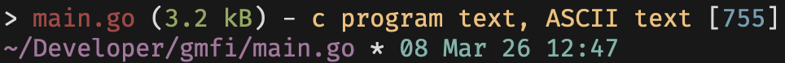

# gmfi [](https://goreportcard.com/report/github.com/jvqtil/gmfi)
The ultimate files utility: get file(s) info, directory tree, files diff, search files and <a href="#usage">much more</a>
 


#### Feel free to contribute! 
 
## Install

#### Fastest way 
Just run this command in terminal and it will install everything itself
```sh
curl -L https://raw.githubusercontent.com/jvqtil/gmfi/refs/heads/master/install.sh | sh
```
or if you prefer GoLang package manager use
```sh
go install github.com/jvqtil/gmfi@latest
```
#### Manual way
Go to [releases](https://github.com/jvqtil/gmfi/releases/) and download latest binary for your OS, then move it to `/usr/local/bin/` and enjoy with simple `gmfi` in terminal!

## Building
- Install [Go](https://go.dev/) and make sure it's working with `go version`
- Clone repo
- Run `go build` in repo directory, then move it to `/usr/local/bin/`

## Usage
The main app command `gmfi <filename> [or more files]` is used to see file / dir info

Here's a list of all commands
```
commands:
 find     <pattern> [path]
  find files in directory
 compare  <file> <another file>
  compare two files
 tree     [path]
  display folder structure
 biggest  [count] [path]
  show biggest files in a directory
 smallest [count] [path]
  show smallest files in a directory
flags:
 -h | --help
 -v | --version
```
