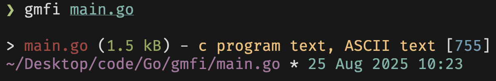

# gmfi
Get file info fast and simple
 


#### Feel free to contribute! 
 
## Install

#### Fastest way 
Run this command in terminal and it will install everything itself
```sh
curl https://raw.githubusercontent.com/Fynjirby/gmfi/refs/heads/main/install.sh | sh
```
#### Manual way
Go to [releases](https://github.com/Fynjirby/gmfi/releases/) and download latest binary for your OS, then move it to `/usr/local/bin/` and enjoy with simple `gmfi` in terminal!

## Building
- Install [Go](https://go.dev/) and make sure it's working with `go version`
- Clone repo
- Run `go build` in repo directory, then move it to `/usr/local/bin/`

## Usage
`gmfi [filename]` to see file / dir info

## Options: 
	-h, --help       Show the help 
	-v, --version    Show version information
